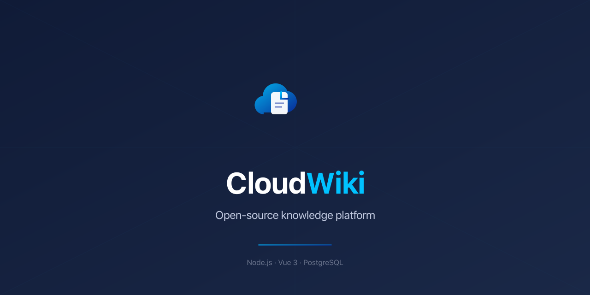
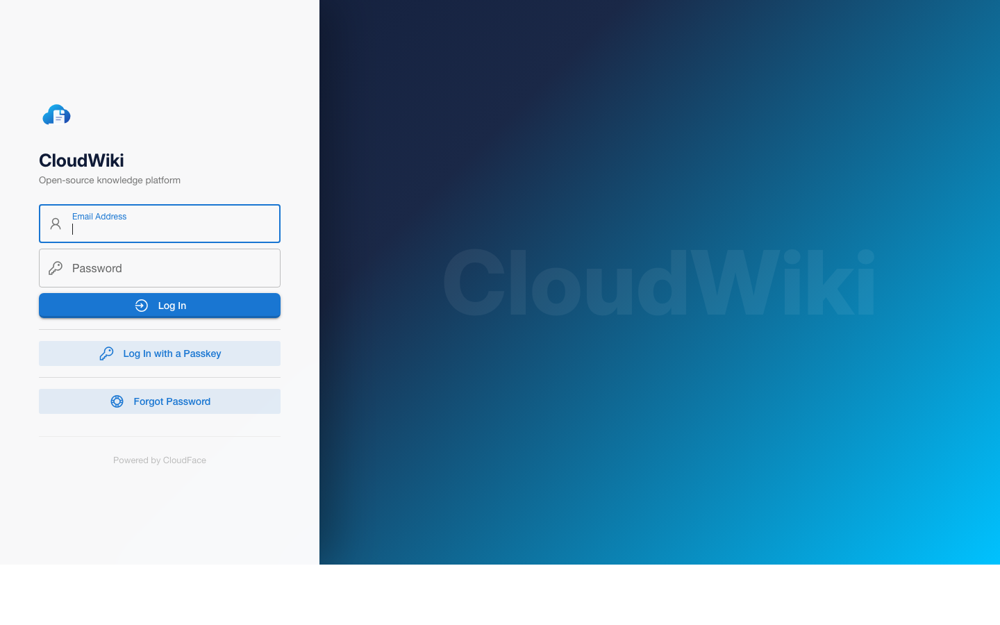

<div align="center">



<br />

[](LICENSE)
[](https://github.com/cloudface-tech/cloudwiki/releases)
[](https://github.com/cloudface-tech/cloudwiki/stargazers)
[](https://github.com/cloudface-tech/cloudwiki/issues)
[](https://ghcr.io/cloudface-tech/cloudwiki)

[Website](https://wiki.cloudface.tech) &middot; [Documentation](https://wiki.cloudface.tech/docs) &middot; [Contributing](#contributing) &middot; [Discussions](https://github.com/cloudface-tech/cloudwiki/discussions)

</div>

---

## Why CloudWiki?

Most wiki platforms feel stuck in 2010 or lock you into a SaaS. CloudWiki is different:

- **Modern stack** -- Vue 3, Quasar, Node.js, PostgreSQL. Fast, maintainable, hackable.
- **Real-time collaboration** -- Multiple users editing the same page simultaneously.
- **Beautiful by default** -- Built on the [CloudFace](https://cloudface.tech) design system with a polished dark/light UI.
- **Self-hosted, always** -- Your data stays on your servers. Deploy with Docker in minutes.
- **Extensible** -- Authentication modules, storage backends, rendering engines, analytics integrations.

## Screenshots

<div align="center">

<br /><br />
</div>

> Screenshots of the admin panel and editor will be added once the first production deployment is live.

## Features

| Category | Details |
|---|---|
| **Editors** | WYSIWYG (TipTap), Markdown (Monaco), with live preview |
| **Auth** | OIDC, OAuth2, SAML, LDAP, CAS, Keycloak, local accounts, and 15+ providers |
| **Search** | Full-text search powered by PostgreSQL |
| **Storage** | Database, Git, GitHub, S3, Azure, Google Cloud, SFTP, local disk |
| **Multi-site** | Run multiple wikis from a single installation |
| **i18n** | Interface translated into 40+ languages |
| **Dark mode** | Full dark/light theme support |
| **API** | GraphQL and REST APIs |
| **Collaboration** | Real-time co-editing via Hocuspocus/Y.js |

## Quick Start

### Docker (recommended)

```bash
docker run -d \
  --name cloudwiki \
  -p 3000:3000 \
  -e DB_TYPE=postgres \
  -e DB_HOST=your-db-host \
  -e DB_PORT=5432 \
  -e DB_USER=cloudwiki \
  -e DB_PASS=your-password \
  -e DB_NAME=cloudwiki \
  ghcr.io/cloudface-tech/cloudwiki:latest
```

Then open `http://localhost:3000` and follow the setup wizard.

### Docker Compose

```yaml
services:
  db:
    image: postgres:17
    environment:
      POSTGRES_USER: cloudwiki
      POSTGRES_PASSWORD: changeme
      POSTGRES_DB: cloudwiki
    volumes:
      - db-data:/var/lib/postgresql/data

  cloudwiki:
    image: ghcr.io/cloudface-tech/cloudwiki:latest
    depends_on:
      - db
    ports:
      - "3000:3000"
    environment:
      DB_TYPE: postgres
      DB_HOST: db
      DB_PORT: 5432
      DB_USER: cloudwiki
      DB_PASS: changeme
      DB_NAME: cloudwiki

volumes:
  db-data:
```

```bash
docker compose up -d
```

## Development

```bash
# Clone the repo
git clone https://github.com/cloudface-tech/cloudwiki.git
cd cloudwiki

# Start PostgreSQL
docker compose -f docker-compose.dev.yml up -d

# Copy config
cp config.sample.yml config.yml
# Edit config.yml: set db user/pass/db to "cloudwiki"

# Install dependencies and start frontend dev server
cd ux && pnpm install && pnpm dev

# In another terminal, start the backend
cd server && pnpm install && pnpm dev
```

The frontend runs on `http://localhost:9000` with hot reload. The backend API runs on port `3000`.

### Project Structure

```
cloudwiki/
  ux/                  # Vue 3 + Quasar frontend
    src/
      css/             # CloudFace theme (SCSS)
      layouts/         # Admin, Main, Auth layouts
      pages/           # All pages (Admin*, Login, Index, etc.)
      components/      # Shared components
      stores/          # Pinia stores
  server/              # Node.js backend
    core/              # Kernel, DB, auth, mail
    controllers/       # Express routes
    graph/             # GraphQL resolvers
    models/            # Objection.js models
    modules/           # Auth, storage, rendering plugins
  blocks/              # Content blocks
  dev/                 # Docker, Helm, Packer configs
```

## Contributing

We welcome contributions of all kinds. Whether you're fixing a typo, reporting a bug, adding a feature, or improving documentation -- every contribution matters.

### How to contribute

1. **Fork** the repository
2. **Create a branch** from `main`: `git checkout -b feat/my-feature`
3. **Make your changes** with clear, atomic commits
4. **Test** your changes: `cd ux && pnpm build`
5. **Open a Pull Request** against `main`

### Good first issues

Look for issues labeled [`good first issue`](https://github.com/cloudface-tech/cloudwiki/labels/good%20first%20issue) -- these are specifically selected for new contributors.

### Areas where we need help

- **Translations** -- Help translate CloudWiki into your language
- **Documentation** -- Improve setup guides, API docs, and tutorials
- **Testing** -- Add unit and e2e tests
- **Themes** -- Create new visual themes and layout options
- **Integrations** -- Build new authentication, storage, or analytics modules
- **Accessibility** -- Improve keyboard navigation and screen reader support
- **Bug reports** -- Detailed bug reports with steps to reproduce are incredibly valuable

### Development guidelines

- Follow existing code patterns and naming conventions
- Keep PRs focused -- one feature or fix per PR
- Write descriptive commit messages (`feat:`, `fix:`, `docs:`, `chore:`)

See [CONTRIBUTING.md](.github/CONTRIBUTING.md) for more details.

## Roadmap

- [ ] Plugin marketplace
- [ ] PDF export
- [ ] Diagram editor (Mermaid, Draw.io)
- [ ] Webhooks and automation
- [ ] Advanced permissions (per-page ACLs)
- [ ] Mobile-optimized reader

Have an idea? Open a [discussion](https://github.com/cloudface-tech/cloudwiki/discussions).

## Tech Stack

| Layer | Technology |
|---|---|
| Frontend | Vue 3, Quasar v2, Pinia, Apollo GraphQL |
| Backend | Node.js, Express, GraphQL (Apollo Server) |
| Database | PostgreSQL (Knex.js + Objection.js) |
| Editors | TipTap (WYSIWYG), Monaco (Markdown) |
| Collaboration | Hocuspocus + Y.js |
| Build | Vite, pnpm |
| Deploy | Docker, Helm, GitHub Actions |

## License

CloudWiki is licensed under [AGPL-3.0](LICENSE). See [NOTICE](NOTICE) for attribution.

---

<div align="center">

Built by [CloudFace](https://cloudface.tech)

If CloudWiki is useful to you, consider giving it a star. It helps others find the project.

</div>
